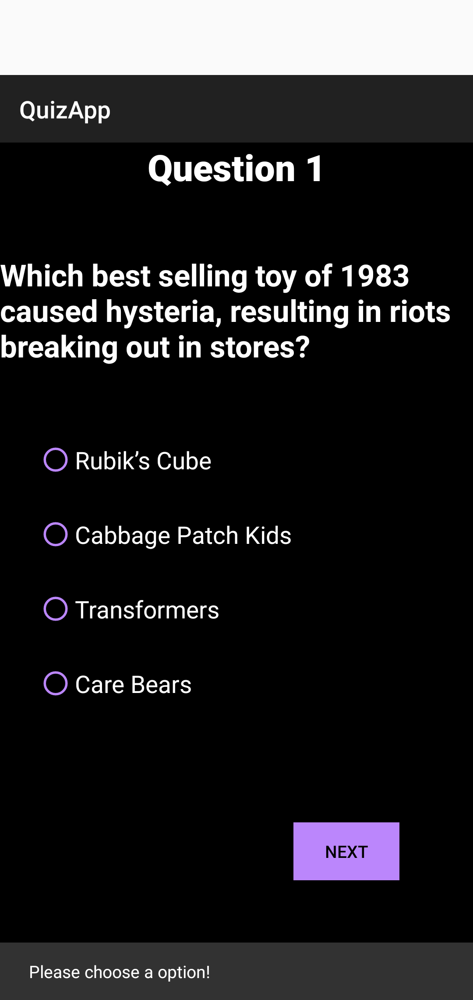

# Quiz App

  

This is a simple application on Quiz. The app contains :

- Various categories to select.

- 3 difficulty levels.

  

The application runs on **Trivia Quiz Api**.

<image  src="markdown_images/HomePage.png"  height = "400px"  width = "25%">&nbsp;&nbsp;&nbsp;&nbsp;&nbsp;<image  src="markdown_images/QuizPage.png"  height = "400px"  width = "25%">&nbsp;&nbsp;&nbsp;&nbsp;&nbsp;
<image  src="markdown_images/ScorePage.png"  height = "400px"  width = "25%">

  
  

## Home Page

  
This page contains :
- **Rules** : 10 questions, all single correct, no backtraking, no next question without selecting a option.
- **Categories**: A wide range of categories are avaliable.
- **Difficulties**: Three levels : Easy, Medium, Hard.
- **Start**: This button will start the quiz(Note: After pressing the start button the app may freeze as it is taking out questions!)
You can select them using the drop down menu.

<image  src="markdown_images/CategoryOpen.png"  height = "400px"  width = "25%">&nbsp;&nbsp;&nbsp;&nbsp;&nbsp;<image  src="markdown_images/DifficultyOpen.png"  height = "400px"  width = "25%">

## Quiz Page

This page is the actual quiz. It consists of :
- **Question number** : This contains the question number.
- **Question**: This is the acutual question
- **Options**: There are 4 options. Only one of them is correct.
- **Next**: This button will take to next question.

There is no backtracking. No back button pressing is allowed.

There is no going to next question unless an option is selected.

## Score Page

The score page consists of :
- **Score** : Your score in quiz.
- **Play Again**: This will take you to home page for playing again.

Pressing back button will also take you to home page.

## Further Improvements

The further improvements can be :
- Add score storing mechanism.
- Add highest score functionality.
- Add functionality to go to previous question.
-  Add functionality to go to next question without selecting options.

## Download

You can download app from here.
<!--stackedit_data:
eyJoaXN0b3J5IjpbODY2NDIxNjU5LC04NTUwMTc4NzYsMTA0ND
g5MzYzNl19
-->